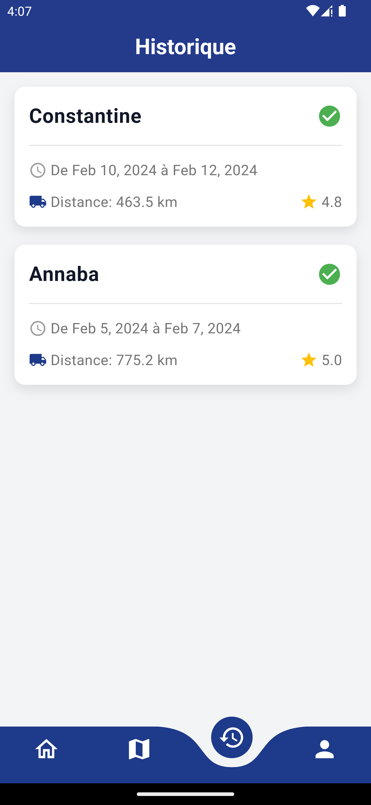
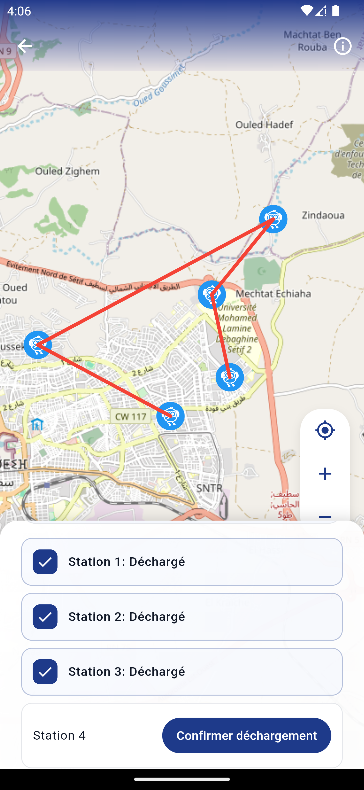
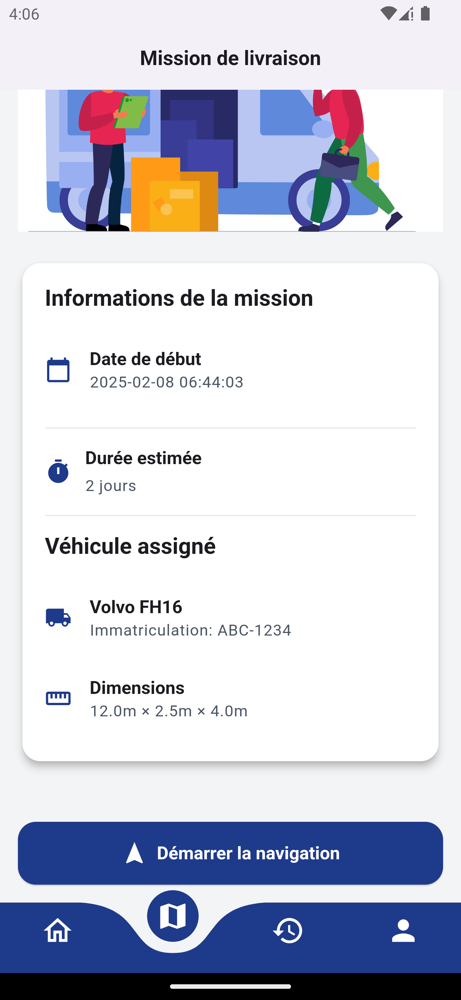
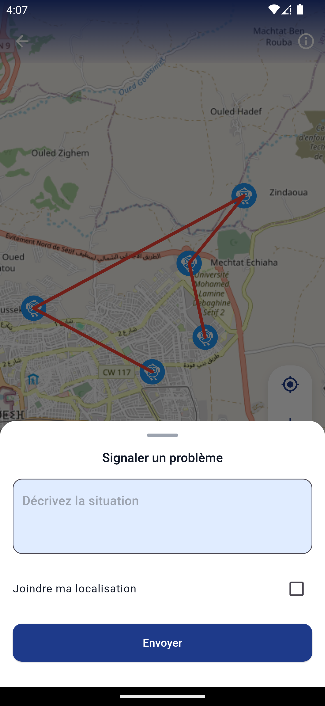
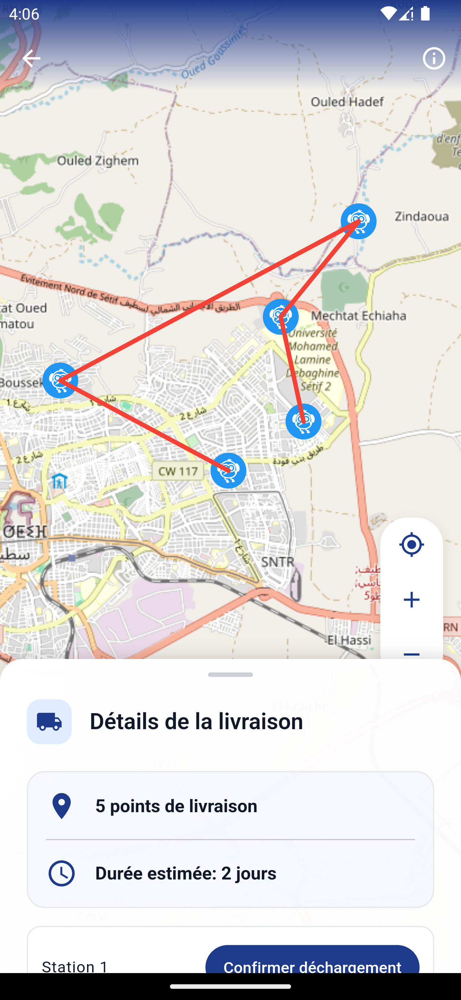

# Axio Driver 🚛

Application mobile développée dans le cadre du Hackathon Tatweer 2025 (en qlq heures seuelement), permettant aux chauffeurs de suivre et gérer leurs livraisons de manière efficace et moderne.


## 🏆 Hackathon Tatweer

Ce projet a été développé lors du Hackathon Tatweer, il fait partie de notre solution Axio qui vise à optimiser les processus de planificaiton, chargement, et tranport en logistique

## ✨ Fonctionnalités

- 📍 Suivi en temps réel des points de livraison
- ✅ Confirmation des déchargements par station
- 🚨 Signalement des problèmes avec géolocalisation
- 🗺️ Navigation interactive avec OSRM (Open Source Routing Machine)
- 📱 Interface moderne et intuitive

## 📱 Screenshots

<div style="display: flex; justify-content: space-between;">
    
        
        
            
            
    
    

</div>

## 🚀 Installation

### Prérequis

- Flutter SDK (version 3.0.0 ou supérieure)
- Dart SDK (version 2.17.0 ou supérieure)
- Android Studio / VS Code
- Git

### Configuration

1. Clonez le dépôt :

```bash
git clone https://github.com/aminetech26/axio-driver.git
```

2. Installez les dépendances :

```bash
cd axio-driver
flutter pub get
```

3. Configurez les variables d'environnement :

   - Créez un fichier `.env` à la racine du projet
   - Ajoutez les clés nécessaires :

4. Lancez l'application :

```bash
flutter run
```

## 🛠️ Technologies Utilisées

- Flutter
- Go Router pour la navigation
- Flutter Map avec OSRM pour le routage et la cartographie open-source
- BLoC pour la gestion d'état
- Dio pour les requêtes HTTP

## 💡 Pourquoi OSRM ?

Nous avons choisi OSRM (Open Source Routing Machine) pour plusieurs raisons :

- Solution open-source
- Pas de coûts liés aux API propriétaires
- Personnalisation complète des données cartographiques

## 🤝 Contribution

Les contributions sont les bienvenues ! N'hésitez pas à :

1. Fork le projet
2. Créer une branche (`git checkout -b feature/AmazingFeature`)
3. Commit vos changements (`git commit -m 'Add some AmazingFeature'`)
4. Push sur la branche (`git push origin feature/AmazingFeature`)
5. Ouvrir une Pull Request

## 📞 Contact

Pour toute question ou suggestion, n'hésitez pas à nous contacter :

- Email : [la_guerraiche@esi.dz]

---

Développé avec ❤️ pour le Hackathon Tatweer 2025
